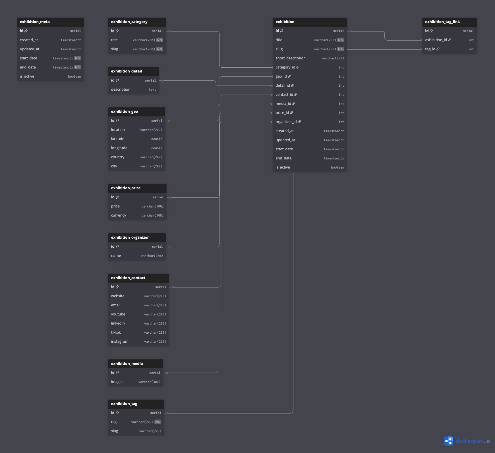

# culture_aggregator

# Diagram of the database

[link](https://dbdiagram.io/d/69c2dd4b78c6c4bc7a5af4cd)

---

## 🚀 Tech Stack

TravelCultureHub is built using a modern, scalable Python backend with strong support for async processing, data aggregation, and content management.

### 🧠 Backend & API

* **FastAPI** `0.115.12` – high-performance API framework
* **Uvicorn** `0.34.2` – ASGI server
* **Strawberry GraphQL** – GraphQL API layer
* **SQLAlchemy** `2.0.40` – ORM and database toolkit

### 🗄️ Database & ORM

* **PostgreSQL** (via `asyncpg 0.30.0`) – primary database
* **Piccolo ORM** `1.25.0` – async ORM
* **Piccolo Admin** `1.10.0` – admin interface

### 🌐 Web & Templating

* **Jinja2** `3.1.6` – templating engine
* **Markdown** `3.8` – content formatting
* **itsdangerous** `2.2.0` – secure data signing
* **pytz** `2025.2` – timezone handling

### 🤖 Data Parsing & NLP

* **BeautifulSoup4** `4.13.4` – HTML parsing
* **lxml** `5.4.0` – fast XML/HTML processing
* **transformers** `4.52.4` – NLP pipelines
* **torch** `2.7.1` – deep learning backend
* **dateparser** `1.2.2` – natural language date parsing

### 📊 Data Processing & Utilities

* **pandas** `2.3.0` – data manipulation
* **aiohttp** `3.12.13` – async HTTP client
* **requests** `2.32.4` – HTTP requests
* **tqdm** `4.67.1` – progress tracking
* **python-dotenv** `1.1.0` – environment management

### 🧩 Helpers & Formatting

* **python-slugify** `8.0.4` – URL-friendly slugs
* **Unidecode** `1.4.0` – text normalization
* **fake-agent** `0.1.4` – user-agent rotation
* **chardet** `5.2.0` – encoding detection
* **mdformat** `0.7.22` – Markdown formatting

